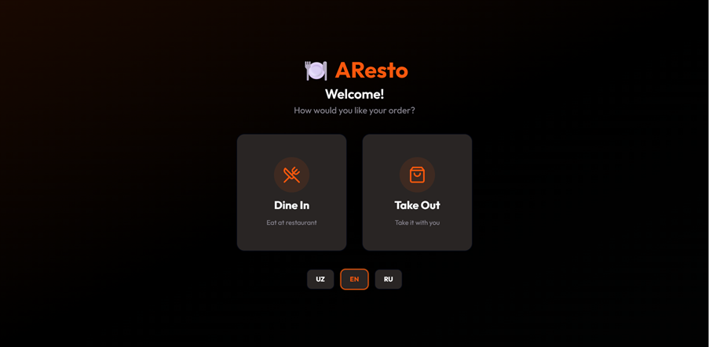
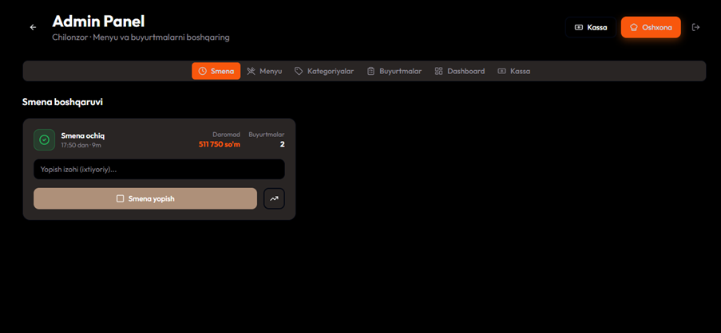
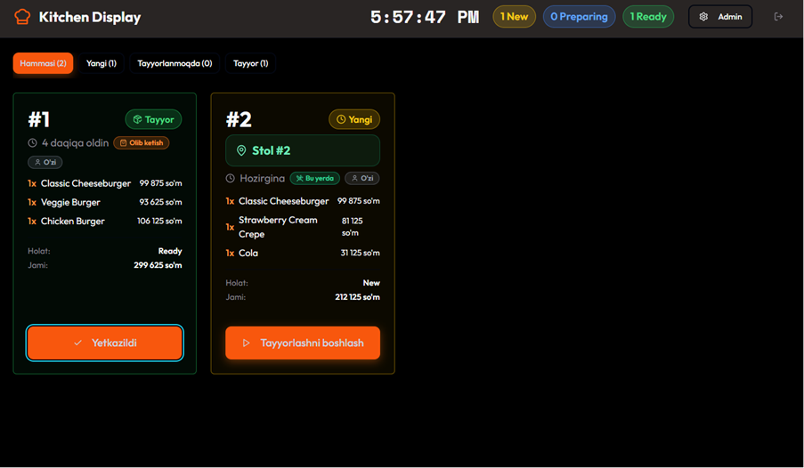

# AResto

**Restaurant Management & Ordering System — University Final Year Project**

A full-stack restaurant platform for managing orders, menu items, tables, shifts, payments, and restaurant operations.

## Features

- Role-based workflows for Admin, Kitchen, and Menu Management
- Order, table, shift, and payment management
- Atomic order creation with PostgreSQL functions
- Real-time updates with Supabase Realtime
- Dashboard analytics
- QR/table-based ordering
- 3D/AR food visualization

## Tech Stack

React · TypeScript · Vite · Supabase · PostgreSQL · Firebase · Tailwind CSS · shadcn/ui

## Screenshots

### Main Page


### Admin Panel


### Kitchen Display


## Demo Video

[▶ Watch AResto Demo Video](docs/demo/demo.MOV)

> The demo video is included in the repository and shows the main application workflow.

## Architecture

- React frontend with component-based architecture
- Supabase for database, authentication, RLS, and realtime features
- PostgreSQL functions for transactional business logic
- Service layer for order, table, payment, and restaurant operations

## Database

PostgreSQL database with entities for branches, tables, shifts, orders, order items, menu items, and related restaurant data.

## Installation

```bash
npm install
npm run dev
```

Create the required environment variables based on `.env.example` before running the project.
